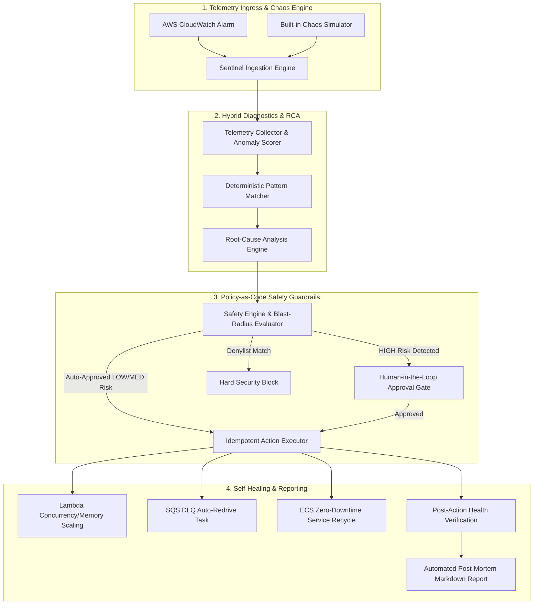

<div align="center">

# 🛡️ Sentinel-SRE

**Autonomous Cloud Reliability & Self-Healing SRE Platform**

[](https://python.org)
[](https://aws.amazon.com)
[](#architecture)
[](LICENSE)
[](#testing)

*Sentinel-SRE reduces cloud incident MTTR (Mean Time to Resolution) from 45 minutes to **under 5 seconds** by fusing deterministic telemetry analysis with policy-guarded autonomous remediation.*

</div>

---

## 📌 Table of Contents
- [Executive Overview](#-executive-overview)
- [System Architecture](#-system-architecture)
- [How It Works (6-Phase Lifecycle)](#-how-it-works-6-phase-lifecycle)
- [Policy-as-Code & Safety Guardrails](#-policy-as-code--safety-guardrails)
- [Included Failure Scenarios](#-included-failure-scenarios)
- [Quickstart & Interactive Demo](#-quickstart--interactive-demo)
- [CLI Reference](#-cli-reference)
- [Webhook API & Ingress](#-webhook-api--ingress)
- [Project Layout](#-project-layout)
- [Testing](#-testing)

---

## 🌟 Executive Overview

In production cloud environments, when an incident occurs at 03:00 AM, human on-call engineers spend 30-45 minutes waking up, querying CloudWatch logs, correlating metrics, formulating a fix, and applying it.

**Sentinel-SRE automates this entire lifecycle safely:**
1. **Deterministic Telemetry Correlator:** Aggregates CloudWatch alarms, metric anomalies, and distributed log streams.
2. **Hybrid Root-Cause Analysis (RCA):** Identifies exact failure signatures (concurrency bottlenecks, DLQ backlogs, OOM crashloops).
3. **Strict Policy-as-Code Guardrails:** Blocks dangerous operations, validates blast-radius limits, and gates high-risk changes.
4. **Idempotent Self-Healing Executors:** Executes verified remediation actions across AWS Lambda, SQS, and ECS.
5. **Zero-Touch Post-Mortem Generation:** Produces instant executive post-mortem reports with timeline and MTTR.

---

## 📐 System Architecture



---

## 🔄 How It Works (6-Phase Lifecycle)

| Phase | Description | Output |
| :--- | :--- | :--- |
| **1. Trigger** | Ingests CloudWatch Alarm or Webhook payload. | Structured `Incident` Model |
| **2. Telemetry** | Fetches logs, metric series, and resource state around the incident window. | `TelemetrySnapshot` with anomaly deviations |
| **3. RCA** | Correlates error logs and metrics with known failure patterns. | `RootCauseAnalysis` with ranked confidence |
| **4. Guardrail** | Evaluates action against `policies.yaml` (blast-radius, allowlist, rate limits). | `SafetyVerdict` (Allowed vs Gate) |
| **5. Remediate** | Calls idempotent AWS action provider (Lambda, SQS, ECS) with rollback tracking. | `ActionExecutionResult` (Execution in ms) |
| **6. Post-Mortem**| Verifies service recovery and generates complete incident documentation. | Clean Markdown Post-Mortem report |

---

## 🛡️ Policy-as-Code & Safety Guardrails

Autonomous agents must **never** execute destructive or unconstrained commands in production. Sentinel-SRE enforces strict determinism via [`policies.yaml`](sentinel_sre/safety/policies.yaml):

```yaml
policies:
  - action_type: "sqs:start_dlq_redrive"
    risk_level: "LOW"
    auto_approve: true
    max_messages_per_run: 50000

  - action_type: "lambda:set_concurrency"
    risk_level: "MEDIUM"
    auto_approve: true
    max_allowed_concurrency: 500
    min_allowed_concurrency: 5

  - action_type: "rds:reboot_db_instance"
    risk_level: "HIGH"
    auto_approve: false
    requires_approval_role: "sre-lead"

denylist:
  - "*:delete*"
  - "*:terminate_all"
  - "iam:*"
```

---

## 🚨 Included Failure Scenarios

You can run and test Sentinel-SRE **completely offline without AWS credentials** using the built-in scenario suite:

1. **`sc-lambda-01` — Lambda Concurrency Saturation & Throttling**
   * *Trigger:* Flash sale spike saturates concurrency (10), throwing `TooManyRequestsException`.
   * *Remediation:* Dynamically scales reserved concurrency to 100 within safety bounds.
2. **`sc-sqs-02` — SQS Dead Letter Queue (DLQ) Accumulation**
   * *Trigger:* Database connection pool timeout pushes 1,450 failed orders into DLQ.
   * *Remediation:* Initiates managed `StartMessageMoveTask` to re-drive messages back to main queue.
3. **`sc-ecs-03` — ECS Memory Leak (OOMKilled CrashLoop)**
   * *Trigger:* Memory leak causes Linux kernel OOM killer (exit code 137) on container tasks.
   * *Remediation:* Triggers a zero-downtime rolling service task recycling deployment.

---

## ⚡ Quickstart & Interactive Demo

### 1. Installation
```bash
git clone https://github.com/ekrmcakir/sentinel-sre.git
cd sentinel-sre

# Create and activate virtual environment
python3 -m venv .venv
source .venv/bin/activate

# Install dependencies
pip install -r requirements.txt
```

### 2. Run Interactive Live Showcase
Run the zero-dependency live demonstration with one command:
```bash
python demo.py
```

---

## 💻 CLI Reference

Sentinel-SRE includes a full-featured terminal interface powered by `Rich` and `Typer`:

```bash
# List all simulated chaos scenarios
sentinel scenarios

# Inject and remediate an outage scenario
sentinel simulate sc-lambda-01

# Run SQS DLQ Backlog remediation
sentinel simulate sc-sqs-02

# Run ECS Container CrashLoop remediation
sentinel simulate sc-ecs-03

# Start the Webhook API server for live CloudWatch ingestion
sentinel serve --port 8080
```

---

## 🌐 Webhook API & Ingress

Start the webhook ingress server:
```bash
sentinel serve
```

Send a CloudWatch Alarm payload:
```bash
curl -X POST http://localhost:8080/api/v1/webhook/cloudwatch \
  -H "Content-Type: application/json" \
  -d '{
    "AlarmName": "Payments_HighThrottles_Alarm",
    "Service": "lambda",
    "ResourceArn": "arn:aws:lambda:us-east-1:123456789012:function:payment-service",
    "ResourceName": "payment-service",
    "MetricName": "Throttles",
    "Threshold": 5.0,
    "CurrentValue": 142.0,
    "Severity": "P1_CRITICAL",
    "Description": "High throttles detected on payment processing Lambda"
  }'
```

---

## 📁 Project Layout

```text
sentinel-sre/
├── sentinel_sre/
│   ├── models/             # Strongly-typed domain models (Incident, Telemetry, RCA, Actions)
│   ├── safety/             # Policy-as-Code engine, Blast-radius calculator, policies.yaml
│   ├── telemetry/          # CloudWatch and offline Mock telemetry collectors
│   ├── rca/                # Hybrid RCA engine with signature pattern matcher
│   ├── actions/            # Idempotent AWS action executors (Lambda, SQS, ECS)
│   ├── orchestrator/       # State machine managing the 6-phase incident lifecycle
│   ├── reporting/          # Automated Post-Mortem & Timeline Markdown compiler
│   ├── simulator/          # Chaos engineering testbed & incident scenarios
│   ├── api/                # FastAPI CloudWatch webhook server
│   └── cli.py              # Rich CLI tool
├── tests/                  # Unit and integration test suite
├── demo.py                 # Single-command interactive showcase runner
├── requirements.txt        # Production dependencies
└── README.md
```

---

## 🧪 Testing

Run the comprehensive test suite:
```bash
pytest tests/ -v
```

```text
tests/test_safety_guardrails.py::test_safe_sqs_action_allowed PASSED
tests/test_safety_guardrails.py::test_safe_lambda_concurrency_allowed PASSED
tests/test_safety_guardrails.py::test_excessive_lambda_concurrency_blocked PASSED
tests/test_safety_guardrails.py::test_dangerous_denylist_action_hard_blocked PASSED
tests/test_safety_guardrails.py::test_high_risk_rds_reboot_requires_approval PASSED
tests/test_rca_engine.py::test_rca_lambda_concurrency_detection PASSED
tests/test_rca_engine.py::test_rca_sqs_dlq_detection PASSED
tests/test_actions.py::test_lambda_action_mock_execution PASSED
tests/test_actions.py::test_sqs_action_mock_execution PASSED
tests/test_actions.py::test_ecs_action_mock_execution PASSED
tests/test_simulator.py::test_scenario_loader PASSED
tests/test_simulator.py::test_trigger_incident_creates_valid_model PASSED
tests/test_orchestrator.py::test_full_orchestration_lifecycle_lambda PASSED
tests/test_orchestrator.py::test_full_orchestration_lifecycle_sqs PASSED
tests/test_orchestrator.py::test_full_orchestration_lifecycle_ecs PASSED

======================== 15 passed in 0.42s ========================
```

---

## 📄 License
This project is open-source under the [MIT License](LICENSE).
